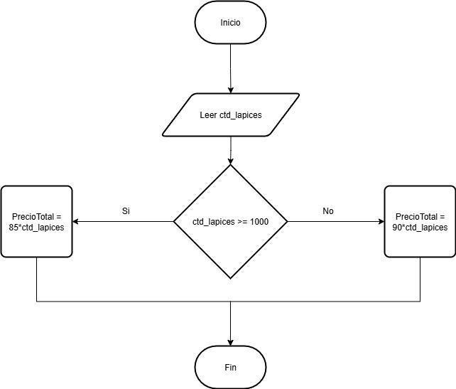

# Ejercicio 1
## ¿Cuáles son los símbolos que se utilizan para representar cada operación de un algoritmo con un diagrama de flujo?

### Para expresar un algoritmo con un diagrama de flujo se utilizan los siguientes símbolos:

1. Óvalo/Terminal: indica el inicio o fin del algoritmo.
2. Paralelogramo/Entrada-Salida: se digita información para la entrada o salida.
3. Rectángulo/Proceso: realiza cualquier calculo u operación con la información digitada en la entrada.
4. Rombo/Decisión: a partir de operación logicas o comparativas, toma una de dos salidas de posibles, dependiendo del resultado de la operación anterior.
5. Flechas: indica el flujo de información del algoritmo.

> A continuación se provee una imagen que describe de manera gráfica los simbolos anteriores (junto con otros adicionales)


# Ejercicio 2
Construye un algoritmo que, al recibir como datos el ID del empleado y los seis primeros sueldos del año, calcule el ingreso total semestral y el promedio mensual, e imprima el ID del empleado, el ingreso total y el promedio mensual.
## Pseudocódigo
```
Inicio
Leer ID_empleado, sueldo 1, sueldo 2, sueldo 3, sueldo 4, sueldo 5, sueldo 6
IngresoTotal = (sueldo 1 + sueldo 2 + sueldo 3 + sueldo 4 + sueldo 5 + sueldo 6)
PromedioMes = (sueldo 1 + sueldo 2 + sueldo 3 + sueldo 4 + sueldo 5 + sueldo 6)/6
Mostrar ID_empleado, IngresoTotal, PromedioMes
Fin
```

## Diagrama de flujo


# Ejercicio 3
Una empresa importadora desea determinar cuántos dólares puede adquirir con equis cantidad de dinero colombiano. Realice un diagrama de flujo y pseudocódigo que representen el algoritmo para tal fin.

## Pseudocódigo 
```
Inicio
PrecioDolar = 4000
Leer PesosColombianos
Adquisicion = PesosColombianos/PrecioDolar
Mostrar Adquisicion
Fin
```

## Diagrama de flujo


# Ejercicios adicionales

## Ejercicio 1
Realice un algoritmo para determinar cuánto se debe pagar por equis cantidad de lápices considerando que si son 1000 o más el costo es de $85 cada uno; de lo contrario, el precio es de $90. Represéntelo con el pseudocódigo y el diagrama de flujo.

## Pseudocódigo
```
Inicio
Leer ctd_lapices
Si ctd_lapices >= 1000
PrecioTotal = 85*ctd_lapices
Si no
PrecioTotal = 90*ctd_lapices
Fin Si
Fin
```

## Diagrama de flujo 


## Ejercicio 2
Un almacén de ropa tiene una promoción: por compras superiores a $250 000 se les aplicará un descuento de 15%, de caso contrario, sólo se aplicará un 8% de descuento. Realice un algoritmo para determinar el precio final que debe pagar una persona por comprar en dicho almacén y de cuánto es el descuento que obtendrá. Represéntelo mediante el pseudocódigo y el diagrama de flujo.

## Pseudocódigo
```
Inicio
Leer valor_compra
Si valor_compra > 250000
dcto = valor_compra*0.15
Si no
dcto = valor_compra*0.08
Fin Si
ValorFinal = valor_compra - dcto
Mostrar "Valor a pagar: $", ValorFinal
Fin
```

## Diagrama de flujo


## Ejercicio 3 
El director de una escuela está organizando un viaje de estudios, y requiere determinar cuánto debe cobrar a cada alumno y cuánto debe pagar a la compañía de viajes por el servicio. La forma de cobrar es la siguiente: si son 100 alumnos o más, el costo por cada alumno es de $65.00; de 50 a 99 alumnos, el costo es de $70.00, de 30 a 49, de $95.00, y si son menos de 30, el costo de la renta del autobús es de $4000.00, sin importar el número de alumnos.

## Pseudocódigo
```
Inicio
    Leer ctd_alumnos
        Si ctd_alumnos > 0
            Si ctd_alumnos >= 100
            ValorTotal = 65*ctd_alumnos 
            Si ctd_alumnos >= 50 
            ValorTotal = 70*ctd_alumnos
            Si ctd_alumnos >= 30
            ValorTotal = 95*ctd_alumnos
            Si ctd_alumnos < 30
            ValorTotal = 4000
        Si no
            Mostrar "El valor introducido no es válido"
        Fin Si
    CobroIndividual = ValorTotal/ctd_alumnos
    Mostrar "El cobro por alumno es: $", CobroIndividual, "el valor a pagar es: $", ValorTotal
Fin
```

## Diagrama de flujo


## Ejercicio 4
Una tienda de ropa tiene la siguiente promoción: por la compra de tres productos, la prenda de menor valor tiene un 70% de descuento. Calcular cuál fue el descuento aplicado y cuánto debe pagar la persona.

## Pseudocódigo
```
Inicio
    Leer ctd_productos
    Leer p1, p2, p3
        Si p1 > 0 y p2 > 0 y p3 > 0
                Si ctd_productos > 0  
                        Si ctd_productos = 3
                            Si p1 < p2 y p1 < p3
                                dcto = p1*0.7
                                PrecioFinal = dcto + p2 + p3
                            Si p2 < p1 y p2 < p3
                                dcto = p2*0.7
                                PrecioFinal = dcto + p1 + p3
                            Si p3 < p2 y p3 < p1
                                dcto = p3*0.7
                                PrecioFinal = dcto + p2 + p3
                            Si no
                            Precio Final = p1 + p2 + p3
                        Fin Si
                        Mostrar PrecioFinal
                    Si no
                    Mostrar "Valor introducido es inválido"
                Fin Si
            Si no
            Mostrar "Precio introducido invalido"
        Fin Si
    Fin
```

## Bucles o ciclos
### Ejercicio 1:
Se requiere un algoritmo para obtener la suma de diez cantidades, que se leen del teclado, mediante la utilización de un ciclo while. Realice el diagrama de flujo y el pseudocódigo.
### Pseudocódigo:
```
Inicio
    i = 0
    suma = 0
        while i <= 10
            Leer cantidad
            i = i + 1
            suma = suma + cantidad
        Fin while
    Mostrar suma
Fin
```
### Diagrama de flujo:


### Ejercicio 2:
Un profesor tiene un salario inicial de $1500, y recibe un incremento de 10% anual durante 6 años ¿Cuál es su salario al cabo de 6 años? ¿Qué salario ha recibido en cada uno de los 6 años? Realice el algoritmo y represente la solución mediante el diagrama de flujo y el pseudocódigo. 

### Pseudocódigo:
```
Inicio
    i = 1
    Salario = 1500
    SalarioTotal = 0
    mientras i <= 6 
        SalarioAnual = Salario*1,1 -- 100% + 10%
        Salario = SalarioAnual
        SalarioTotal = SalarioTotal + SalarioAnual
        Mostrar SalarioAnual
        i = i + 1
    Fin mientras
    Mostrar SalarioTotal
Fin
```
### Diagrama de flujo:


### Ejercicio 3:
Se requiere un algoritmo para determinar, de N cantidades, cuántas son cero, cuántas son menores a cero, y cuántas son mayores a cero. Realice el diagrama de flujo y el pseudocódigo.

### Pseudocódigo:
```
Inicio
    c = 0 -- cantidades igual a cero
    p = 0 -- cantidades mayores que cero
    m = 0 -- cantidades menores que cero
    i = 0
    Leer N
    mientras i < N
        i = i + 1
        Leer ctd
        si ctd > 0
            p = m + 1 
        si ctd = 0 
            c = c + 1
        si no
            m = n + 1
    Fin mientras
Fin
```
### Diagrama de flujo:


    
